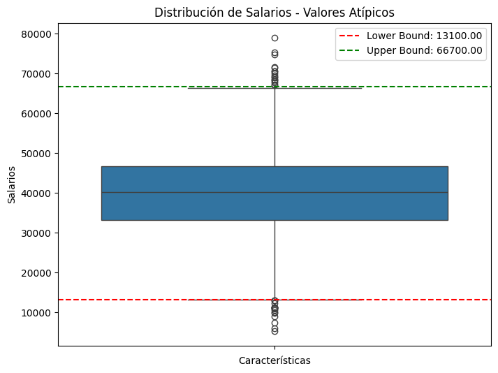
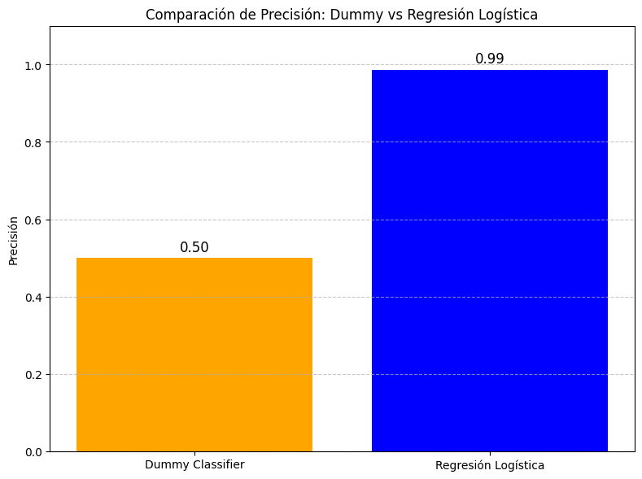
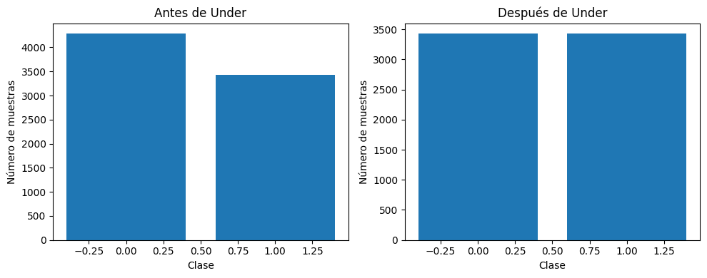
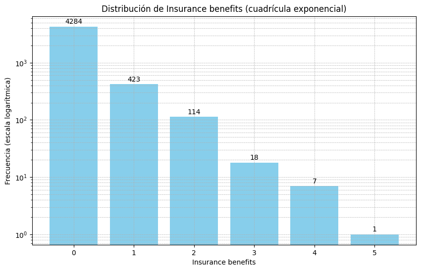

# Proyecto: Predicción de Beneficios de Seguro y Protección de Datos

Este proyecto tiene como objetivo ayudar a la compañía de seguros **Sure Tomorrow** a realizar varias tareas utilizando técnicas de machine learning, asegurando la protección de los datos personales de los clientes sin comprometer el rendimiento del modelo.

## Tareas

1. **Encontrar clientes similares a un cliente determinado**: Esta tarea ayuda a los agentes de marketing a identificar clientes con características similares para optimizar sus estrategias de marketing.

   
2. **Predecir si un nuevo cliente recibirá un beneficio de seguro**: Se comparan los resultados de un modelo entrenado con los de un modelo dummy no entrenado para evaluar su efectividad.

3. **Predecir la cantidad de beneficios de seguro que recibirá un cliente**: Utilizando un modelo de regresión lineal, se predicen los beneficios basados en diversas características del cliente.

4. **Proteger los datos personales de los clientes sin afectar el modelo de predicción**: Se desarrolla un algoritmo de enmascaramiento de datos para asegurar que los datos personales de los clientes sean difíciles de recuperar en caso de filtraciones, sin afectar la calidad de los modelos de machine learning.

## Descripción de los Datos

El dataset se encuentra en el archivo **/datasets/insurance_us.csv** y contiene las siguientes características:

- **Sexo**
- **Edad**
- **Salario**
- **Número de familiares**
  
El objetivo es predecir el **número de beneficios de seguro** recibidos por una persona asegurada en los últimos cinco años.

## Resultados de las Tareas

## CONCLUSIONES
**Tarea 1:** Búsqueda de clientes similares
- Utilizamos el algoritmo Nearest Neighbors con la métrica 'cosine', lo que nos permite medir la similitud en función del ángulo entre los vectores de características. Esto es útil para encontrar clientes con perfiles similares.
- Implementamos un algoritmo que identifica los 5 clientes más similares a un perfil dado en función de esta métrica.

**Tarea 2:** Predicción de clientes que recibirán beneficios
- Aplicamos Regresión Logística para identificar a los clientes con mayor probabilidad de recibir un beneficio.
- Transformamos la variable objetivo Insurance benefits en una variable binaria, donde todos los valores mayores a 0 se convirtieron en 1.
- Realizamos escalamiento de datos para optimizar el procesamiento del modelo.
- Aplicamos técnicas de balanceo de clases, ya que los datos estaban desbalanceados.
- Comparamos los resultados de la Regresión Logística con un modelo base (dummy) que asigna etiquetas aleatorias con una precisión de 0.5. Nuestro modelo de Regresión - - 
- Logística alcanzó una precisión del 99%, demostrando su efectividad.

**Tarea 3:** Comparación de modelos para predicción de Salary
- Escalamos únicamente la variable Salary, ya que presentaba una gran variabilidad en comparación con las demás características.
- Probamos cuatro modelos de regresión para determinar el más óptimo:
- Random Forest Regressor resultó ser el modelo con mejor desempeño, obteniendo los siguientes resultados:
- **Entrenamiento:**
    - RMSE = 0.01
    - R² = 1.00
- **Prueba:**
    - RMSE = 0.02
    - R² = 1.00
- **Validación:**
    - RMSE = 0.01
     - R² = 1.00
- Estos resultados sugieren que el modelo comprende bien las relaciones entre las características y generaliza correctamente. Sin embargo, dado que el max_depth del modelo fue 1, podría existir un riesgo de sobreajuste. No obstante, al comparar los resultados en los conjuntos de prueba y validación, observamos un rendimiento estable, lo que indica que el modelo generaliza adecuadamente.

**Tarea 4:** Ofuscación de datos y evaluación de impacto
- Aplicamos un método de ofuscación para proteger la información sensible de los clientes:
- Agrupamos la variable Age en rangos de edad.
- Introdujimos ruido controlado en la variable Salary.
- Entrenamos nuevos modelos con los datos enmascarados y utilizamos One-Hot Encoding para procesar las variables categóricas.
- Evaluamos el impacto de la ofuscación comparando los resultados con los datos originales:
- **Linear Regression:**
    - MSE: 0.02
    - R²: 0.92
- **Random Forest Regressor:**
    - MSE: 0.03
    - R²: 0.88

- Linear Regression mostró métricas más estables después de la ofuscación, lo que indica que pudo adaptarse mejor a los datos transformados.
Random Forest Regressor, en cambio, se vio más afectado, ya que este modelo depende de relaciones más complejas, las cuales se redujeron debido a la ofuscación.
